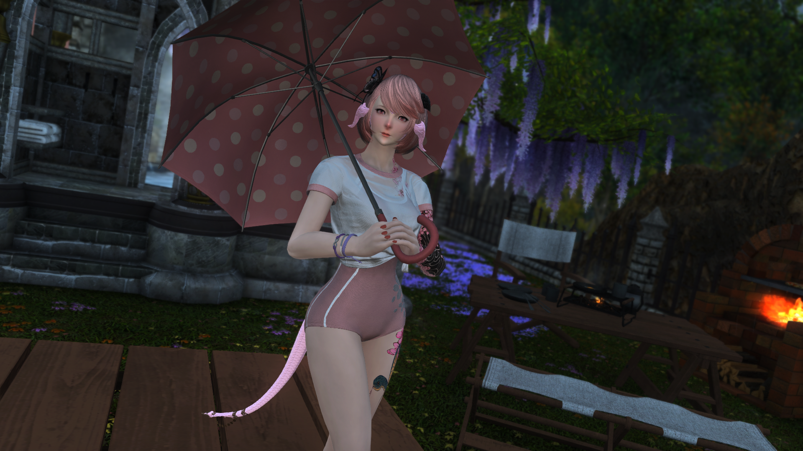

# NatsuReShadeXIV

A distribution of my ReShade setup with specific configurations tailored toward the critically acclaimed MMORPG Final Fantasy XIV

# Installation

[[Download Latest](https://github.com/NatsumeLS/NatsuReShadeXIV/releases/latest)]

Extract `NatsuReShadeXIV_vx.x.zip`

in `C:\Program Files (x86)\SquareEnix\FINAL FANTASY XIV - A Realm Reborn\game`

*ReShade binaries are included for convenience.

However, I still recommend getting them yourself from [here](https://reshade.me/). (Download one with full add-on support)

# Presets / Shaders
Feel free add your own presets to `natsu-presets` and shaders in `natsu-shaders\Custom`

If I missed any shaders, please don't hesitate to ask me to include them.

# Preview
**Click on image to view**

# Included Presets

Suitable for both gameplay and screenshot usage.

Focus on being as close to real lighting as possible while not being oversaturated.

- **NatsuReShadeXIV** *Free
- **NatsuReGradeXIV** *Requires qUINT ReGrade, RTGI, and Physical DOF. From [Pascal Gilcher's Patreon](https://www.patreon.com/mcflypg)

**RTGlobalIllumination** is enabled by default (NVIDIA RTX 3060 / AMD RX 6600 or better is recommended)

Enable **PhysicalDOF_MKII** for additional Depth of Field effect (Focus with Middle Mouse button)

Enable **Atmospheric Density** for fog effect

# Recommended In-Game Settings
- Edge Smoothing (Anti-aliasing): FXAA
- Transparent Lighting Quality: High

# Contact
Discord: NatsumeLS#1123
