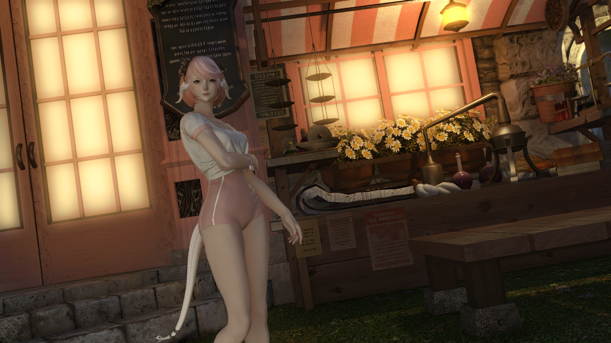
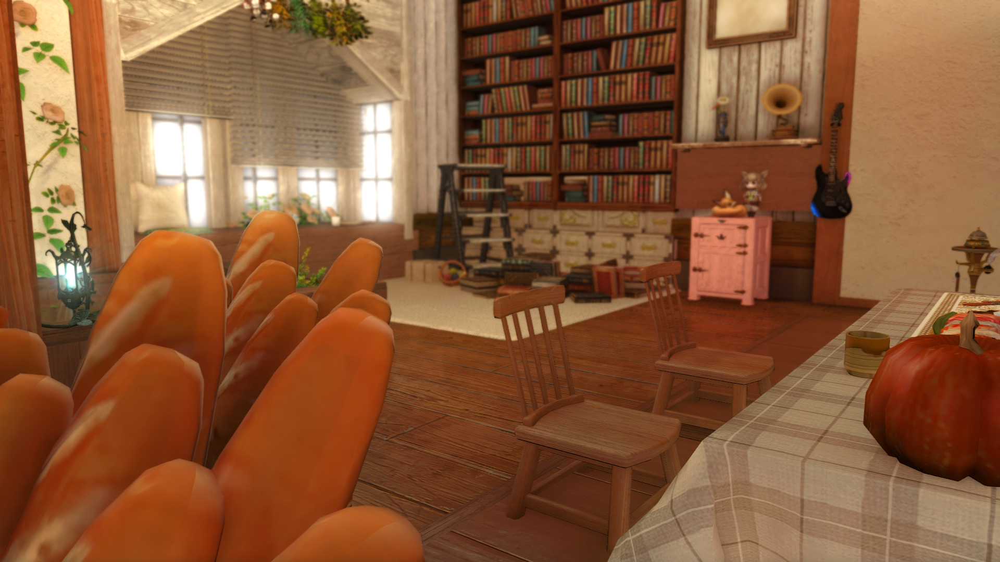
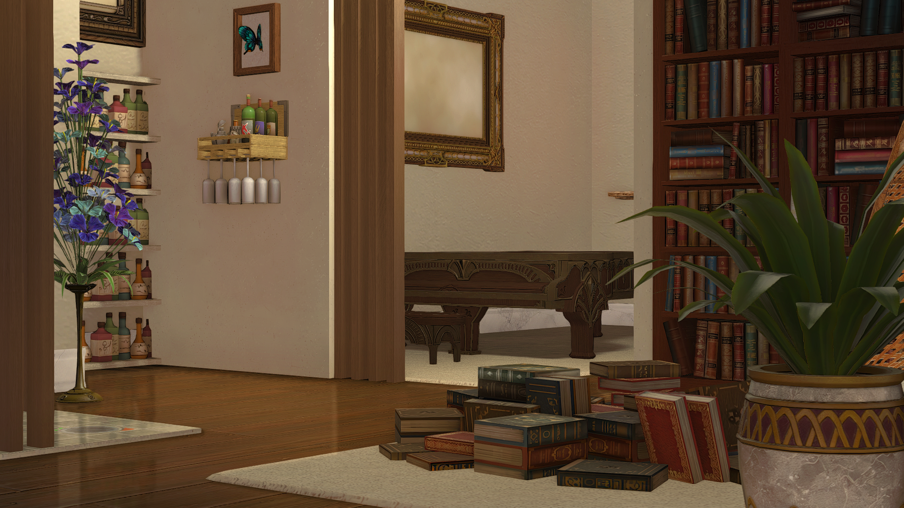

# NatsuReShadeXIV

A distribution of my ReShade setup with specific configurations tailored toward the critically acclaimed MMORPG Final Fantasy XIV.

## Guide

### 1. Download

📁 [Got to Download Page](https://github.com/NatsumeLS/NatsuReShadeXIV/releases/latest)

### 2. Install

Extract `NatsuReShadeXIV_vx.x.zip` at `FINAL FANTASY XIV - A Realm Reborn\game` (Game Location)

Example `C:\Program Files (x86)\SquareEnix\FINAL FANTASY XIV - A Realm Reborn\game`

### 3. Recommended In-Game Settings

- Full Screen Mode Gamma Correction: 50
- Edge Smoothing (Anti-aliasing): FXAA
- Transparent Lighting Quality: High
- Screen Space Ambient Occlusion: Off

## Included Preset

**NatsuReShadeXIV** is suitable for both gameplay and screenshot usage.

Focus on being as close to original visual as possible while not being oversaturated.

### Features

> - Global Illumination
> - Subsurface Scattering
> - Always On Depth of Field
> - Ambient Occlusion
> - Eye Adaption
> - Anti Aliasing

**Click on image to view comparision**

